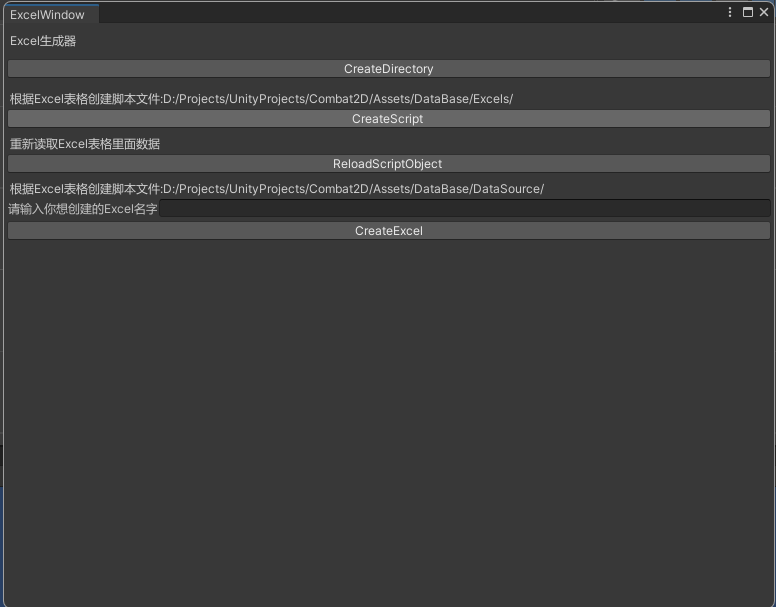

# ExcelManager
用于Unity处理Excel表单导入的一个工具

## 图片展示

自定义编辑器窗口



文件架构


## 功能描述

* 将Excel文件数据转为Unity格式的ScriptObject进行保存读取
* DataScriptObject提供基础的读取数据的方法
* 根据指定目录读取Excel文件自动创建脚本

## 按钮解释

* CreateDirectory 创建该Excel处理库所需要的文件夹架构
* CreateScript 分别有两次点击，第一次点击默认创建缺失的脚本文件，第二次点击，创建对应的ScriptObject数据
* ReloadScriptObject 重载Excel里面修改的内容，将其同步到ScriptObject当中去
* CreateExcel 通过鼠标选择（可以多选）指定的文件，去创建对应的Excel文件到指定目录

## 注意事项

* 一个Excel里面有多个表单，一个表单对应着一个数据条目List<DataItem>
* 一行数据对应的一个DataItem
* 一个Excel文件对应着一个DataScriptObject的派生类
* 规定脚本文件里面的命名空间，统一采用DataSystem.,如果脚本未采取命名空间，将会失效！！！
* 路径，命名空间，都可以在脚本文件FilePath.cs中进行修改

## 代码示例

通过创建好对应所需要的Excel表格 DataItem派生类 DataScriptObject派生类如下

EnemyProperty
```C#
using System;
using UnityEngine;
using System.Collections.Generic;
using ExcelManager;
namespace DataSystem
{
[Serializable]
public class EnemyProperty : DataItem
{
public string EnemyName;
public int Health;

}
}
```

PlayerProperty
```C#
using System;
using UnityEngine;
using System.Collections.Generic;
using ExcelManager;
namespace DataSystem
{
[Serializable]
public class PlayerProperty : DataItem
{
public String PlayerName;
public Int32 Health;
public Int32 BP;

}
}
```

CharacterPropertyScriptObject
```C#
using UnityEngine;
using System.Collections.Generic;
using ExcelManager;
namespace DataSystem
{
public class CharacterPropertyScriptObject : DataScriptObject
{

public List<PlayerProperty> PlayerPropertyList;
public List<EnemyProperty> EnemyPropertyList;
}
}
```

在测试文件当中，进行初始化

```C#
using System;
using DataSystem;
using ExcelManager;
using UnityEngine;

public class Test : MonoBehaviour
{
    //获取这个Excel文件对应的ScriptObject
    CharacterPropertyScriptObject cpso;
    void Awake()
    {
        //将数据读取到内存当中
        //传入参数为 Excel文件的名字
        cpso = DataScriptObject.GetData<CharacterPropertyScriptObject>("CharacterProperty");
    }

    void Start()
    {
        //输出这个Excel表格的第一行的PlayerName的值
        Debug.Log(cpso.PlayerPropertyList[0].PlayerName);
    }
}
```

##  方法说明

```C#
        //传入参数为Excel的名字，也就是实例化后对应的ScriptObject的文件名，如果有更改，要留意了
        public static T GetData<T>(string dataName) where T : DataScriptObject;
```